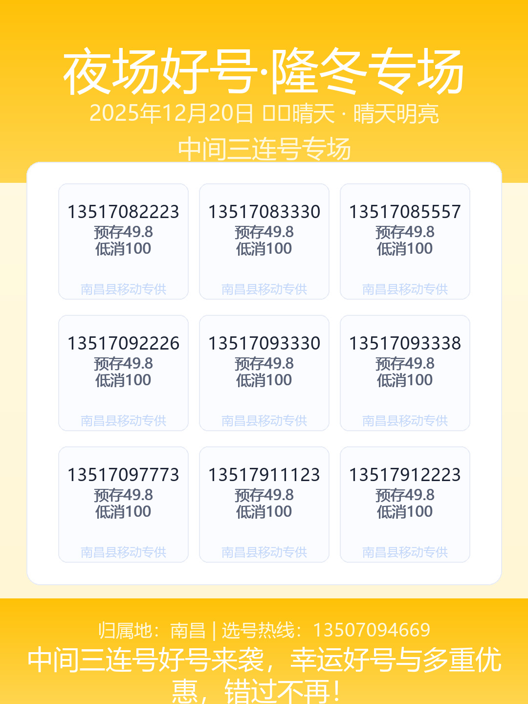

# 🎯 吉祥号码海报自动生成及发送系统

[](https://www.python.org/downloads/)
[](LICENSE)

> 一个强大的中文手机号码营销海报自动生成器，支持AI文案生成、Web界面操作，以及**自动发送到微信公众号或企业微信**。

## ✨ 核心特性

### 📱 海报生成
- 🎨 精美的3×3网格布局
- 🌈 多主题渐变背景(春夏秋冬、节日主题)
- 🤖 AI智能文案生成(GPT-4支持)
- 📊 Excel数据批量处理
- 🔄 号码去重和使用记录

### 🚀 微信自动发送 (NEW!)
- ✅ **微信公众号**自动创建草稿
- ✅ **企业微信**直接发送消息
- ⏰ 定时任务(每天12点和18点自动发送)
- 🔐 安全的配置管理
- 📝 详细的发送日志

### 🌐 Web界面
- 💻 友好的可视化操作界面
- 📂 在线文件管理和下载
- 🎲 随机分类选择
- ⚡ 实时生成状态显示

## 📸 效果预览

<div align="center">

<p><em>自动生成的吉祥号码海报示例</em></p>
</div>

## 🚀 快速开始

### 安装依赖

```bash
pip install -r requirements.txt
```

### 方式1: 命令行生成

```bash
# 生成一张海报
python main.py --once

# 生成并发送到微信
python main.py --once --send

# 启动定时任务(12点和18点自动发送)
python main.py --schedule
```

### 方式2: Web界面

```bash
# 启动Web服务器
python web_app.py

# 或双击
start_web.bat
```

然后访问: http://127.0.0.1:5000

### 方式3: 定时任务

双击 `start_schedule.bat` 启动后台定时任务，系统将在每天12点和18点自动生成并发送海报。

## 📱 微信自动发送配置

### 第一步: 创建配置文件

```bash
copy wechat_config.example.json wechat_config.json
```

### 第二步: 选择发送方式

#### 选项A: 微信公众号

```json
{
  "send_type": "public",
  "config": {
    "app_id": "你的AppID",
    "app_secret": "你的AppSecret"
  }
}
```

**获取方式**:
1. 登录 https://mp.weixin.qq.com/
2. 进入 `设置与开发 -> 基本配置`
3. 复制开发者ID和开发者密码

**注意**: 需要认证的公众号

#### 选项B: 企业微信 (推荐)

```json
{
  "send_type": "work",
  "config": {
    "corp_id": "你的企业ID",
    "agent_id": 1000001,
    "agent_secret": "你的应用Secret"
  }
}
```

**获取方式**:
1. 登录 https://work.weixin.qq.com/
2. 创建自建应用
3. 获取企业ID、AgentId和Secret

**优点**: 完全自动化，更稳定

### 第三步: 测试发送

```bash
python main.py --once --send
```

看到 `[OK] 微信发送成功` 表示配置正确！

详细配置指南: [微信发送使用指南.md](微信发送使用指南.md)

## 📋 命令行完整参数

```bash
python main.py [选项]

选项:
  --once                    立即生成一张海报
  --send                    生成后自动发送到微信
  --category CATEGORY       指定分类(如"尾号双重")
  --schedule                启动定时任务
  --list-categories         列出所有分类
  --debug                   显示调试信息
  --excel PATH              使用自定义Excel文件
  --slot morning|noon|evening  指定时段
```

### 使用示例

```bash
# 基础生成
python main.py --once

# 指定分类生成
python main.py --once --category "尾号双重"

# 生成并发送到微信
python main.py --once --send --debug

# 查看所有分类
python main.py --list-categories

# 启动定时任务(12点和18点自动发送)
python main.py --schedule
```

## 🏗️ 项目结构

```
luck/
├── main.py                          # 命令行入口
├── web_app.py                       # Web界面服务器
├── start_web.bat                    # Web界面启动脚本
├── start_schedule.bat               # 定时任务启动脚本
├── 吉祥号码.xlsx                    # 号码数据源
├── used_numbers.json                # 已使用号码记录
├── wechat_config.json               # 微信配置(需创建)
├── wechat_config.example.json       # 微信配置示例
├── requirements.txt                 # Python依赖
├── CLAUDE.md                        # 项目总览文档
├── 微信发送使用指南.md              # 微信功能详细指南
├── 微信发送功能开发总结.md          # 功能开发总结
├── app/
│   ├── config.py                    # 配置管理
│   ├── data_loader.py               # Excel数据加载
│   ├── selection.py                 # 号码选择算法
│   ├── poster_generator_v2.py       # 海报渲染引擎
│   ├── ai_copy.py                   # AI文案生成
│   ├── wechat_sender.py            # 微信发送模块 (NEW!)
│   ├── theme_system.py              # 主题系统
│   ├── weather_api.py               # 天气API
│   └── holidays_util.py             # 节日工具
├── output/                          # 生成的海报
└── templates/                       # Web界面模板
```

## 📊 数据格式

### Excel文件要求 (`吉祥号码.xlsx`)

| 号码 | 预存 | 低消 | 分类说明 |
|------|------|------|----------|
| 13517082223 | 49.8 | 100 | 中间三连号 |
| 13517083330 | 49.8 | 100 | 中间三连号 |
| ... | ... | ... | ... |

### 支持的分类

- 尾号双重
- 中间任意数字
- *AABB
- *ABC
- 尾号双重689
- 尾号至尾号
- 更多...

## ⏰ 定时计划

启动 `python main.py --schedule` 后:

| 时间 | 动作 | 是否发送微信 |
|------|------|-------------|
| 09:00 | 生成海报 | ❌ 否 |
| 12:00 | 生成海报 | ✅ **自动发送** |
| 18:00 | 生成海报 | ✅ **自动发送** |

## 🎨 主题系统

系统会根据时间和节日自动选择主题:

- 🌸 **春季主题**: 粉色渐变
- ☀️ **夏季主题**: 蓝绿渐变
- 🍂 **秋季主题**: 橙黄渐变
- ❄️ **冬季主题**: 蓝白渐变
- 🎄 **节日主题**: 春节、中秋等特殊主题

## 🤖 AI文案生成

设置环境变量启用AI文案:

```bash
# Windows
set OPENAI_API_KEY=your_api_key_here

# Linux/Mac
export OPENAI_API_KEY=your_api_key_here
```

AI会根据分类、时段、节日生成定制化营销文案。

## 🔒 安全建议

1. **不要**将 `wechat_config.json` 提交到Git
2. 添加到 `.gitignore`:
   ```
   wechat_config.json
   ```
3. 使用环境变量存储敏感信息
4. 定期更换API密钥

## 📖 文档

- [CLAUDE.md](CLAUDE.md) - 项目总览和架构说明
- [微信发送使用指南.md](微信发送使用指南.md) - 微信功能详细配置
- [微信发送功能开发总结.md](微信发送功能开发总结.md) - 功能开发记录
- [主题系统使用说明.md](主题系统使用说明.md) - 主题系统文档

## ❓ 常见问题

### Q: 为什么生成失败?
**A**: 某个分类的可用号码可能不足9个,请选择其他分类或使用随机选择。

### Q: 微信发送失败怎么办?
**A**:
1. 检查 `wechat_config.json` 配置是否正确
2. 查看控制台错误日志
3. 确认公众号已认证或企业微信应用已创建
4. 参考[微信发送使用指南.md](微信发送使用指南.md)

### Q: 如何修改定时发送时间?
**A**: 修改 [app/config.py](app/config.py) 中的 `schedule_plan`，然后在 [main.py](main.py) 中调整自动发送时间判断。

### Q: 能否同时发送到多个账号?
**A**: 当前版本仅支持单个账号,可以通过修改代码支持多账号轮发。

### Q: 如何自定义海报样式?
**A**: 编辑 [app/poster_generator_v2.py](app/poster_generator_v2.py)，调整颜色、字体、布局等参数。

## 🎯 功能路线图

- [x] 基础海报生成
- [x] Web界面
- [x] 定时任务
- [x] AI文案生成
- [x] 主题系统
- [x] 微信公众号发送
- [x] 企业微信发送
- [ ] 多账号支持
- [ ] Web配置界面
- [ ] 发送历史记录
- [ ] 邮件通知
- [ ] 数据统计分析

## 🤝 贡献

欢迎提交Issue和Pull Request!

## 📄 许可证

MIT License

## 💬 联系方式

- 项目地址: [GitHub](https://github.com/yourusername/luck)
- 问题反馈: [Issues](https://github.com/yourusername/luck/issues)

---

<div align="center">
<p><strong>Made with ❤️ by AI</strong></p>
<p>© 2025 吉祥号码海报自动生成系统 v2.0</p>
</div>
